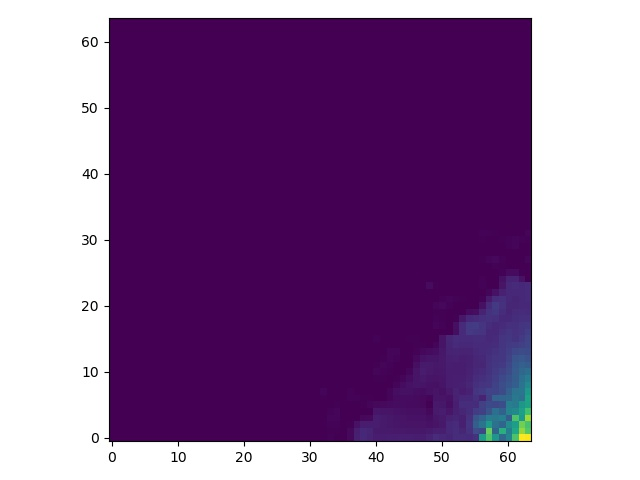
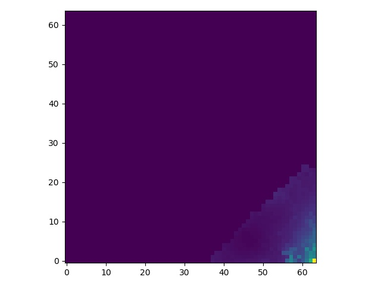

# Demonstration of HiPS tile orientation

This script and images show that both HiPS tiles and HiPS all-sky files 
are up-down flipped in FITS format when compared to the JPEG and PNG format.

Note that FITS viewers will display images such that (0, 0) is at the lower left.
All images shown here follow the JPEG convention and image viewers of having
(0, 0) be located at the to left.

## Tile image example

### Original image in JPG format

### From JPG format from the script

### From FITS format from the script

## All-sky image example

### Original image in JPG format

### From JPG format from the script

### From FITS format from the script

